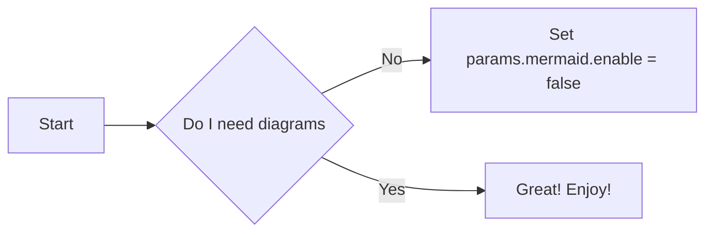

默认情况下，使用 Docsy 的站点具有主题的默认字体、颜色和一般外观。 然而，如果你想要你自己的配色方案（你可能会！）你可以很容易地用你自己的项目特定值覆盖主题默认值 - 在寻找信息来构建你的站点时，Hugo 将首先查看你的项目文件。 此外，由于 Docsy 使用 Bootstrap 4 和 SCSS 进行样式设置，您可以仅覆盖其特殊 SCSS 项目变量文件中的单个值，或者通过创建您自己的整个 SCSS 文件版本来进行更严格的自定义。

## 调色板和其他样式

要快速更改站点的颜色，请将 SCSS 变量项目覆盖添加到 `assets/scss/_variables_project.scss`。 将主要和次要颜色更改为两种紫色阴影的简单示例：

```scss
$primary: #390040;
$secondary: #A23B72;
```

* 请参阅主题中的`assets/scss/_variables.scss` 以了解颜色变量等，可以设置这些变量以更改外观。
* 另请参阅 Bootstrap 4 中的可用变量：https://getbootstrap.com/docs/4.0/getting-started/theming/ 和 https://github.com/twbs/bootstrap/blob/v4-dev/scss/_variables。 scss

该主题具有默认启用的圆角和渐变背景等功能。 这些也可以在您的项目变量文件中切换：

```scss
$enable-gradients: true;
$enable-rounded: true;
$enable-shadows: true;
```

{}
在服务器模式下运行时未启用 PostCSS（CSS 浏览器前缀的自动加前缀）（它有点慢），因此建议使用 Chrome 进行开发。
{}

另请注意，任何 SCSS 导入都会在主题之前尝试项目，因此您可以 - 作为一个示例 - 创建自己的 `_assets/scss/_content.scss` 并完全控制 Markdown 内容的样式。

## 字体

该主题使用 [Open Sans](https://fonts.google.com/specimen/Open+Sans) 作为其主要字体。 要禁用 Google 字体并使用系统字体，请在 `assets/scss/_variables_project.scss` 中设置此 SCSS 变量：

```scss
$td-enable-google-fonts: false;
```

要配置另一个 Google 字体：

```scss
$google_font_name: "Open Sans";
$google_font_family: "Open+Sans:300,300i,400,400i,700,700i";
```

请注意，如果您决定使用不同粗细的字体（在内置配置中，这是“300”（轻）、“400”（中）和“700”（粗）），您还需要调整 权重相关变量，即以`$font-weight-`开头的变量。

## CSS 实用程序

有关可用 CSS 实用程序类的文档，请参阅 [Bootstrap 文档](https://getbootstrap.com/)。 这个主题本身在这方面几乎没有增加。 但是，我们添加了一些在动态上下文中很有用的颜色状态 CSS 类：

* `.-bg-<color>`
* `.-text-<color>`

例如，当您不知道“主要”颜色是深还是浅时，您可以使用这些类以适当的颜色设置文本样式，以确保适当的颜色对比度。 当您将颜色代码作为 [shortcode](/docs/adding-content/shortcodes/) 参数接收时，它们也很有用。

`<color>` 的值可以是任何颜色名称，`primary`、`white`、`dark`、`warning`、`light`、`success`、`300`、`blue`、`orange `等。

当你使用 `.-bg-<color>` 时，文本颜色将被调整以获得适当的对比度：

```html
<div class="-bg-primary p-3 display-4">Background: Primary</div>
<div class="-bg-200 p-3 display-4">Background: Gray 200</div>
```

<div class="-bg-primary p-3 display-4 w-75">Background: Primary</div>
<div class="-bg-200 p-3 display-4 mb-5 w-50 w-75">Background: Gray 200</div>

`.-text-<color>` sets the text color only:

```html
<div class="-text-blue pt-3 display-4">Text: Blue</div>
```

<div class="-text-blue pt-3 display-4">Text: Blue</div>

## 使用 Chroma 突出显示代码

使用 Hugo 0.60 及更高版本，您可以使用 [Chroma](https://github.com/alectomas/chroma) 从一系列代码块突出显示和颜色样式中进行选择，这些样式默认应用于您的围栏代码块。 如果你复制了最近的 `config.toml` 你的站点使用 Tango（就像这个站点），否则 Hugo 默认是 Monokai。 您可以使用您的 `config.toml` 切换到任何 [可用的色度样式](https://xyproto.github.io/splash/docs/all.html)（包括我们的 Docsy 默认 Tango）：


```toml
[markup]
  [markup.goldmark]
    [markup.goldmark.renderer]
      unsafe = true
  [markup.highlight]
      # See a complete list of available styles at https://xyproto.github.io/splash/docs/all.html
      style = "tango"
 ```

默认情况下，代码突出显示样式不会应用于没有指定语言的代码块，而是使用 Docsy 的默认灰色和黑色文本样式。 如果您希望代码突出显示样式应用于所有代码块，即使没有语言，请取消注释或在您的 `config.toml` 的 `[markup.highlight]` 下添加以下行。

```toml
# Uncomment if you want your chosen highlight style used for code blocks without a specified language
guessSyntax = "true"
```

您可以在 [Syntax Highlighting](https://gohugo.io/content-management/syntax-highlighting/) 中找到更多关于 Hugo 中代码高亮和 Chroma 的信息。

## 使用 Prism 突出显示代码

或者，您可以在您的 `config.toml` 中启用 Prism 语法高亮：

```toml
# Enable syntax highlighting and copy buttons on code blocks with Prism
prism_syntax_highlighting = true
```

启用此选项后，您的站点将使用 [Prism](https://prismjs.com/index.html) 而不是 Chroma 来突出显示代码块。

Prism 是一种流行的开源语法高亮器，支持 200 多种 [语言](https://prismjs.com/index.html#supported-languages) 和各种 [插件](https://prismjs.com/index.html# 插件）。

Docsy 包含用于基本 Prism 配置的 JavaScript 和 CSS 文件，它支持：

* 使用 Prism `Default` 主题设计的代码块
* 复制到代码块上的剪贴板按钮
* 多种常用语言的语法高亮显示，如以下 Prism 下载链接中所述：


```none
    https://prismjs.com/download.html#themes=prism&languages=markup+css+clike+javascript+bash+c+csharp+cpp+go+java+markdown+python+scss+sql+toml+yaml&plugins=toolbar+copy-to-clipboard    
```

### 没有语言的代码块

默认情况下，Prism 代码突出显示样式不会应用于没有指定语言的代码块，而是使用 Docsy 的默认灰色和黑色文本样式。 要将 Prism 样式应用于没有语言或 Prism 不支持的语言的代码块，请在三个反引号后指定“none”作为语言。

### 为其他语言或插件扩展 Prism

如果包含的 Prism 配置不足以满足您的要求，并且您想使用其他语言或插件，您可以将包含的文件替换为您自己的。

1. 从 <https://prismjs.com/download.html> 下载你自己的 Prism JS 和 CSS 文件
2. 将包含的 Prism JS 和 CSS 替换为您下载的文件：
     * 复制Javascript文件到`static/js/prism.js`
     * 复制CSS文件到`static/css/prism.css`

## \\(\LaTeX\\) 支持 \\(\KaTeX\\)

[\\(\LaTeX\\)](https://www.latex-project.org/) 是用于制作技术和科学文档的高质量排版系统。由于其出色的数学排版能力，\\(\TeX\\) 成为科学文献交流和出版的事实上的标准，尤其是当这些文献包含大量数学公式时。最初的版本由 Donald Knuth 设计并主要由 Donald Knuth 编写，于 1978 年发布。回溯到那时，\\(\LaTeX\\) 将 `pdf` 作为其主要输出目标，并不是特别适合为网。幸运的是，通过 [\\(\KaTeX\\)](https://katex.org/) 存在一个快速且易于使用的 JavaScript 库，用于 \\(\TeX\\) 网络上的数学渲染，已集成到 Docsy 主题中。

在 Docsy 中启用 \\(\KaTeX\\) 支持后，您可以将复杂的数学公式包含在您的网页中，无论是内嵌的还是居中的。由于 \\(\KaTeX\\) 依赖于服务器端渲染，因此无论您的浏览器或环境如何，它都会产生相同的输出。公式可以内嵌或显示模式显示：

### 内联公式

以下代码示例生成包含三个内联公式的文本行：

```tex
When \\(a \ne 0\\), there are two solutions to \\(ax2 + bx + c= 0\\) and they are \\(x = {-b \pm \sqrt{b^2-4ac} \over 2a}.\\)
```

当 \\(a \ne 0\\), \\(ax2 + bx + c= 0\\) 有两种解，它们是 \\(x = {-b \pm \sqrt{b^2- 4ac} \over 2a}.\\)

### 显示模式下的公式

以下代码示例生成一个介绍性文本行，后跟一个编号为“(1)”的公式，位于她自己的行上：

```tex
The probability of getting \\(k\\) heads when flipping \\(n\\) coins is:
$$\tag*{(1)} P(E) = {n \choose k} p^k (1-p)^{n-k}$$
```

The probability of getting \\(k\\) heads when flipping \\(n\\) coins is:
$$\tag*{(1)}  P(E) = {n \choose k} p^k (1-p)^{n-k}$$

{}
This [wiki page](https://en.wikibooks.org/wiki/LaTeX/Mathematics) provides in-depth information about typesetting mathematical formulae using the \\(\LaTeX\\) typesetting system.
{}

### 啟用和配置 \\(\LaTeX\\) 支持

要在 Docsy 主題中啟用/禁用 \\(\KaTeX\\) 支持，請更新 `config.toml`：

```toml
[params.katex]
enable = true
```

此外，如果需要，您可以在 config.toml 中自定义各种 \(\KaTeX\) 选项：

```toml
[params.katex]
# enable/disable KaTeX support
enable = true
# Element(s) scanned by auto render extension. Default: document.body
html_dom_element = "document.body"

[params.katex.options]
# If true (the default), KaTeX will throw a ParseError when it encounters an
# unsupported command or invalid LaTeX. If false, KaTeX will render unsupported
# commands as text, and render invalid LaTeX as its source code with hover text
# giving the error, in the color given by errorColor.
throwOnError = false
errorColor = "#CD5C5C"

# This is a list of delimiters to look for math, processed in the same order as
# the list. Each delimiter has three properties:
#   left:    A string which starts the math expression (i.e. the left delimiter).
#   right:   A string which ends the math expression (i.e. the right delimiter).
#   display: Whether math in the expression should be rendered in display mode.
[[params.katex.options.delimiters]]
  left = "$$"
  right = "$$"
  display = true
[[params.katex.options.delimiters]]
  left = "$"
  right = "$"
  display = false
[[params.katex.options.delimiters]]
  left = "\\("
  right = "\\)"
  display = false
[[params.katex.options.delimiters]]
  left = "\\["
  right = '\\]'
  display = true
```

For a complete list of options and their detailed description, have a look at the documentation of \\({\KaTeX}'s\\) [Rendering API options](https://katex.org/docs/autorender.html#api) and of \\({\KaTeX}'s\\) [configuration options](https://katex.org/docs/options.html).

### Display of Chemical Equations and Physical Units

[mhchem](https://www.ctan.org/pkg/mhchem) is a \\(\LaTeX\\) package for typesetting chemical molecular formulae and equations. Fortunately, \\(\KaTeX\\) provides the `mhchem` [extension](https://github.com/KaTeX/KaTeX/tree/master/contrib/mhchem) that makes the `mhchem` package accessible when authoring content for the web. Since this extension was integrated into the Docsy theme, you can write beautiful chemical equations easily once `mhchem` support is enabled inside your `config.toml`:

```toml
[params.katex]
enable = true

[params.katex.mhchem]
enable = true
```

With `mhchem` extension enabled, you can easily include chemical equations into your page. The equations can be shown either inline or can reside on its own line. The following code sample produces a text line including a chemical equation:

```mhchem
*Precipitation of barium sulfate:* \\(\ce{SO4^2- + Ba^2+ -> BaSO4 v}\\)
```

*Precipitation of barium sulfate:* \\(\ce{SO4^2- + Ba^2+ -> BaSO4 v}\\)

More complex equations, like the one shown in the code sample below, should be displayed on their own line:

```mhchem
$$\tag*{(2)} \ce{Zn^2+  <=>[+ 2OH-][+ 2H+]  $\underset{\text{amphoteric hydroxide}}{\ce{Zn(OH)2 v}}$  <=>[+ 2OH-][+ 2H+]  $\underset{\text{tetrahydroxozincate}}{\ce{[Zn(OH)4]^2-}}$}$$
```

$$\tag*{(2)} \ce{Zn^2+  <=>[+ 2OH-][+ 2H+]  $\underset{\text{amphoteric hydroxide}}{\ce{Zn(OH)2 v}}$  <=>[+ 2OH-][+ 2H+]  $\underset{\text{tetrahydroxozincate}}{\ce{[Zn(OH)4]^2-}}$}$$

{}
The [manual](https://mhchem.github.io/MathJax-mhchem/) for mchem’s input syntax provides in-depth information about typesetting chemical formulae and physical units using the `mhchem` tool.
{}

Use of `mhchem` is not limited to the authoring of chemical equations, using the included `\pu` command, pretty looking physical units can be written with ease, too. The following code sample produces two text lines with four numbers plus their corresponding physical units:

```mhchem
* Scientific number notation: \\(\pu{1.2e3 kJ}\\) or \\(\pu{1.2E3 kJ}\\) \\
* Divisions: \\(\pu{123 kJ/mol}\\) or \\(\pu{123 kJ//mol}\\)
```

* 科学数记法：\\(\pu{1.2e3 kJ}\\) 或 \\(\pu{1.2E3 kJ}\\)
* 划分：\\(\pu{123 kJ/mol}\\) 或 \\(\pu{123 kJ//mol}\\)

有关创作物理单位时的完整选项列表，请查看 `mhchem` 文档中有关物理单位的 [部分](https://mhchem.github.io/MathJax-mhchem/#pu)。

## 美人鱼图

[Mermaid](https://mermaid-js.github.io) 是一个 Javascript 库，用于在浏览器中将简单的文本定义呈现为有用的图表。它可以生成多种不同的图表类型，包括流程图、序列图、类图、状态图、ER图、用户旅程图、甘特图和饼图。

在 Docsy 中启用美人鱼支持后，您可以在代码块中包含美人鱼图的文本定义，一旦页面加载，浏览器就会自动呈现。

这样做的最大好处是任何可以编辑页面的人现在都可以编辑图表 - 不再需要寻找原始工具和版本来进行新的编辑。

例如，下面定义了一个简单的流程图：

````

````

Automatically renders to:


To enable/disable Mermaid, update `config.toml`:

```toml
[params.mermaid]
enable = true
```

You also need to disable the `guessSyntax` from markup highlighting in `config.toml`  for Mermaid to work:

```toml
[markup]
  [markup.highlight]
      guessSyntax = "false"
```

You can also update settings for Mermaid, such as themes, padding, etc:

```toml
[params.mermaid]
enable = true
theme = "neutral"

[params.mermaid.flowchart]
diagramPadding = 6
```

有关可以覆盖的默认值列表，请参阅 [Mermaid 文档](https://mermaid-js.github.io/mermaid/#/Setup?id=mermaidapi-configuration-defaults)。

通过使用图表定义开头的“%%init%%”标题，还可以在每个图表的基础上覆盖设置。请参阅[美人鱼主题文档](https://mermaid-js.github.io/mermaid/#/theming?id=themes-at-the-local-or-current-level)。

## UML 图与 PlantUML

[PlantUML](https://plantuml.com/en/) 是 Mermaid 的替代品，可让您快速创建 UML 图，包括序列图、用例图和状态图。与完全在浏览器中呈现的美人鱼图不同，PlantUML 使用 PlantUML 服务器来创建图。您可以使用提供的默认演示服务器（不推荐用于生产用途），或自己运行服务器。 PlantUML 提供比美人鱼更广泛的图像类型，因此对于某些用例可能是更好的选择。

图表是使用简单直观的语言定义的。 （[参见 PlantUML 语言参考指南](https://plantuml.com/en/guide)）。

以下示例显示了一个用例图：


````
```plantuml
participant participant as Foo
actor       actor       as Foo1
boundary    boundary    as Foo2
control     control     as Foo3
entity      entity      as Foo4
database    database    as Foo5
collections collections as Foo6
queue       queue       as Foo7
Foo -> Foo1 : To actor 
Foo -> Foo2 : To boundary
Foo -> Foo3 : To control
Foo -> Foo4 : To entity
Foo -> Foo5 : To database
Foo -> Foo6 : To collections
Foo -> Foo7: To queue
```
````

Automatically renders to:

```plantuml
participant participant as Foo
actor       actor       as Foo1
boundary    boundary    as Foo2
control     control     as Foo3
entity      entity      as Foo4
database    database    as Foo5
collections collections as Foo6
queue       queue       as Foo7
Foo -> Foo1 : To actor 
Foo -> Foo2 : To boundary
Foo -> Foo3 : To control
Foo -> Foo4 : To entity
Foo -> Foo5 : To database
Foo -> Foo6 : To collections
Foo -> Foo7: To queue
```

要启用/禁用 PlantUML，请更新 `config.toml`：

```
[params.plantuml]
enable = true
```

Other optional settings are:
```
[params.plantuml]
enable = true
theme = "default"

#Set url to plantuml server 
#default is http://www.plantuml.com/plantuml/svg/
svg_image_url = "https://www.plantuml.com/plantuml/svg/"

```

## 使用 MarkMap 支持 MindMap

[MarkMap](https://markmap.js.org/) 是一个 Javascript 库，用于在浏览器中将简单的文本定义渲染到 MindMap。

例如，下面定义了一个简单的 MindMap：

````
```markmap
# markmap

## Links

- <https://markmap.js.org/>
- [GitHub](https://github.com/gera2ld/markmap)

## Related

- [coc-markmap](https://github.com/gera2ld/coc-markmap)
- [gatsby-remark-markmap](https://github.com/gera2ld/gatsby-remark-markmap)

## Features

- links
- **inline** ~~text~~ *styles*
- multiline
  text
- `inline code`
-
    ```js
    console.log('code block');
    ```
- Katex - $x = {-b \pm \sqrt{b^2-4ac} \over 2a}$
```
````

自动渲染为：

```markmap
# markmap

## Links

- <https://markmap.js.org/>
- [GitHub](https://github.com/gera2ld/markmap)

## Related

- [coc-markmap](https://github.com/gera2ld/coc-markmap)
- [gatsby-remark-markmap](https://github.com/gera2ld/gatsby-remark-markmap)

## Features

- links
- **inline** ~~text~~ *styles*
- multiline
  text
- `inline code`
-
    ```js
    console.log('code block');
    ```
- Katex - $x = {-b \pm \sqrt{b^2-4ac} \over 2a}$
```

要启用/禁用 MarkMap，请更新 `config.toml`：

```toml
[params.markmap]
enable = true
```

## 自定义模板

### 将代码添加到头部或正文结束之前

如果您需要在每个页面的 `head` 部分添加一些代码（CSS 导入、cookie 同意或类似），请将 `head-end.html` 部分添加到您的项目中：

```
layouts/partials/hooks/head-end.html
```

并在该文件中添加您需要的代码。 您的部分代码会自动包含在主题部分 [`head.html`](https://github.com/google/docsy/blob/master/layouts/partials/head.html) 结束之前。 [`head-end.html`](https://github.com/google/docsy/blob/master/layouts/partials/hooks/head-end.html)的主题版本为空。


同样，如果您想在 `body` 结尾之前添加一些代码，请创建您自己的以下文件版本：


```
layouts/partials/hooks/body-end.html
```

此文件中的任何代码都会自动包含在主题部分 [`scripts.html`](https://github.com/google/docsy/blob/master/layouts/partials/head.html) 的末尾。

`head.html` 和 `scripts.html` 然后用于构建 Docsy 的 [基本页面布局](https://github.com/google/docsy/blob/master/layouts/_default/baseof.html)，其中 被所有其他页面模板使用：

```html
<!doctype html>
<html lang="{{ .Site.Language.Lang }}" class="no-js">
  <head>
    {{ partial "head.html" . }}
  </head>
  <body class="td-{{ .Kind }}">
    <header>
      {{ partial "navbar.html" . }}
    </header>
    <div class="container-fluid td-default td-outer">
      <main role="main" class="td-main">
        {{ block "main" . }}{{ end }}
      </main>
      {{ partial "footer.html" . }}
    </div>
    {{ partialCached "scripts.html" . }}
  </body>
</html>
```

